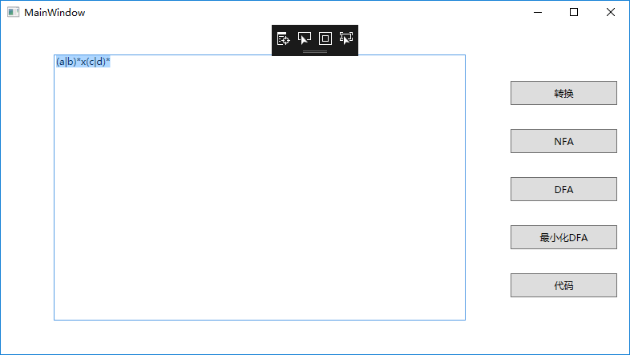

## Visual Regular Expression

Visualize the process, Regular Expression -> NFA -> DFA -> minimized DFA

## GUI

## To Run the Program

You need to Download the Graphviz(2.38 the version i used), extract the bin file to the project root path.